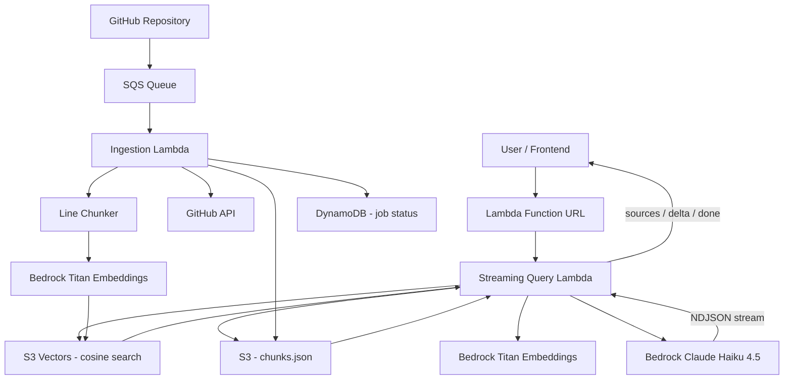

# GitHub RAG System

A production-quality Retrieval-Augmented Generation (RAG) system that ingests GitHub repositories, indexes them with vector embeddings, and answers natural-language questions about the code — with real-time streaming responses.

## What it does

You point it at a GitHub repository. It fetches every source file, splits them into overlapping line-based chunks, embeds each chunk with Amazon Bedrock Titan, and stores the vectors in S3 Vectors. When you ask a question, it embeds the question, finds the most semantically similar chunks via cosine search, and sends them as context to Claude Haiku, which streams back a grounded answer with source citations.

## Key features

- **Line-based chunking** — 120-line chunks with 20-line overlap, prefixed with the file path for attribution
- **1024-dimensional Titan embeddings** — `amazon.titan-embed-text-v2:0` via Bedrock
- **S3 Vectors ANN search** — cosine distance, top-5 retrieval per query
- **Real-time streaming** — Lambda Function URL delivers NDJSON token events directly to the browser
- **Multi-turn chat** — conversation history forwarded to Claude on each request
- **Secure token handling** — GitHub PAT fetched from Secrets Manager, cached per container
- **94 unit tests** — full coverage of ingestion, query, and shared modules

## Architecture




## Tech stack

| Layer | Technology |
|---|---|
| Compute | AWS Lambda (Python 3.12) |
| Embeddings | Amazon Bedrock — Titan Text Embeddings V2 (1024-dim) |
| Vector store | Amazon S3 Vectors (cosine ANN) |
| LLM | Amazon Bedrock — Claude Haiku 4.5 |
| Chunk store | Amazon S3 (chunks.json per repo) |
| Job tracking | Amazon DynamoDB |
| Ingestion queue | Amazon SQS |
| Secrets | AWS Secrets Manager |
| Frontend | Next.js 14 on AWS Amplify |
| Infrastructure | Terraform |

## Query flow

1. Frontend POSTs `{ question, history }` to the Lambda Function URL.
2. Streaming handler validates the request, looks up the repo in DynamoDB.
3. Question is embedded with Titan → 1024-dimensional float32 vector.
4. S3 Vectors `QueryVectors` call returns the top-5 nearest chunks (cosine).
5. Chunk texts are fetched from S3 (`repos/{repo_id}/chunks.json`).
6. A `sources` NDJSON event is streamed to the client immediately.
7. Claude Haiku receives `<context>` + question via `InvokeModelWithResponseStream`.
8. Each token delta is forwarded as a `delta` NDJSON event.
9. A final `done` event carries the complete assembled answer.

## Ingestion flow

1. Client POSTs `{ github_url }` to `POST /repos` → job recorded in DynamoDB as `pending`.
2. Job message published to SQS.
3. Ingestion Lambda triggered by SQS record.
4. GitHub API fetches all text files from the repository (using a PAT from Secrets Manager).
5. Files are split into 120-line chunks with 20-line overlap; capped at 10,000 chunks.
6. Chunks are batch-embedded with Titan in parallel.
7. Chunk metadata (text, source, index) stored in S3 as `chunks.json`.
8. Vectors written to S3 Vectors in batches of 500.
9. DynamoDB status updated to `ready` (or `failed` on error).

## Evaluation

Run the evaluation script against a live deployed system to check that the RAG answers contain expected keywords for five self-referential questions about this codebase.

```bash
export QUERY_API_URL=https://<api-id>.execute-api.eu-west-1.amazonaws.com/prod
export REPO_ID=<uuid-of-ingested-repo>
export API_KEY=<optional-api-key>

python scripts/evaluate_rag.py
```

Results are printed to the terminal and written to `eval/results/latest.json`.

Exit code is `0` if all questions pass, `1` if any fail.

The evaluation dataset is in [`eval/questions.json`](eval/questions.json). Each entry has:
- `question` — natural-language question
- `expected_keywords` — substrings that must appear (case-insensitive) in the answer
- `notes` — what a correct answer should describe

## Observability

All Lambda functions emit structured JSON log lines to stdout (CloudWatch picks these up automatically). Key events:

| Event | Emitted by |
|---|---|
| `ingestion_started` | Ingestion Lambda |
| `fetch_complete` | Ingestion Lambda |
| `chunking_complete` | Ingestion Lambda |
| `embedding_started` / `embedding_complete` | Both Lambdas |
| `vector_search_started` / `vector_search_complete` | Both query Lambdas |
| `llm_call_started` / `llm_call_complete` | Both query Lambdas |
| `request_complete` | Both query Lambdas |
| `ingestion_complete` | Ingestion Lambda |
| `request_error` / `ingestion_failed` | All Lambdas |

Every event includes a `latency_ms` field for the step and a `request_id` for correlation. Sensitive keys (`secret`, `credential`, `token`) are never emitted.

**Useful CloudWatch Insights queries:**

```
# P95 end-to-end query latency
filter event = "request_complete"
| stats pct(latency_ms, 95) as p95, avg(latency_ms) as avg by bin(5m)

# Ingestion failures
filter event = "ingestion_failed"
| fields repo_id, error, total_latency_ms
```

## Local development

```bash
# Install Python dependencies
pip install -r requirements.txt

# Run all tests
pytest tests/ -v

# Run a specific test module
pytest tests/shared/test_observability.py -v
```

Requirements: Python 3.12+, pip packages in `requirements.txt`.

No AWS credentials are needed for unit tests — all AWS clients are mocked.

## Deployment

Infrastructure is managed with Terraform in `infra/terraform/environments/dev/`.

```bash
cd infra/terraform/environments/dev

# First-time setup
terraform init

# Preview changes
terraform plan

# Deploy
terraform apply
```

Required Terraform variables (see `variables.tf`):

| Variable | Description |
|---|---|
| `aws_region` | AWS region to deploy into |
| `github_token_secret_arn` | ARN of Secrets Manager secret holding the GitHub PAT |
| `api_key_secret_arn` | ARN of Secrets Manager secret holding the streaming API key |

Lambda deployment packages are built with:

```bash
bash scripts/build_lambdas.sh
```

## Example questions

Once a repository is ingested, try questions like:

- *"How does the document chunking pipeline work?"*
- *"What embedding model is used and what is the vector dimension?"*
- *"How are vectors stored and searched?"*
- *"How does the streaming response work?"*
- *"How is the GitHub token retrieved securely?"*

## Future improvements

- **Token usage logging** — Bedrock streaming surfaces token counts in `content_block_stop` metadata; capturing these would enable cost tracking
- **LLM-based evaluation** — replace keyword matching with a Claude judge for richer quality scores
- **Re-ingestion deduplication** — skip unchanged files using ETags or content hashes
- **Multi-repo chat** — allow a single conversation to query across multiple indexed repos
- **Chunk size tuning** — expose chunk size and overlap as ingestion parameters
